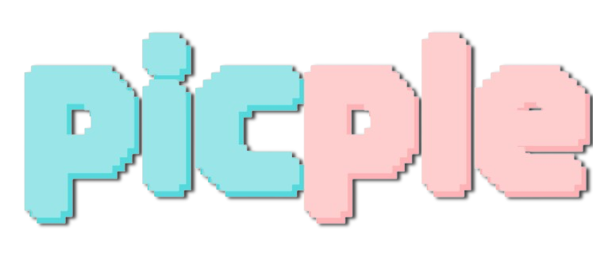
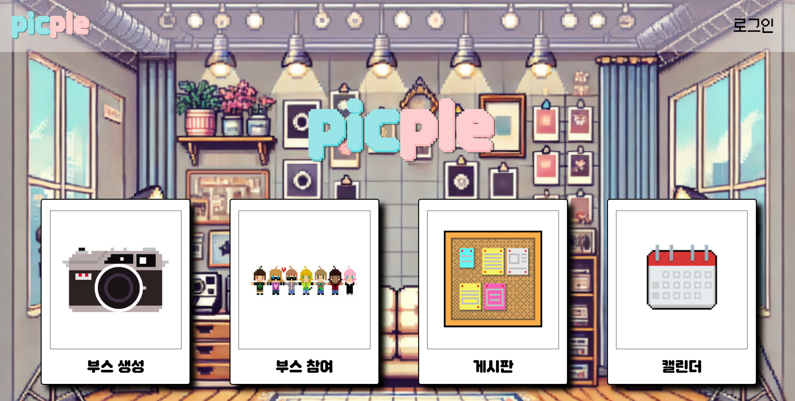
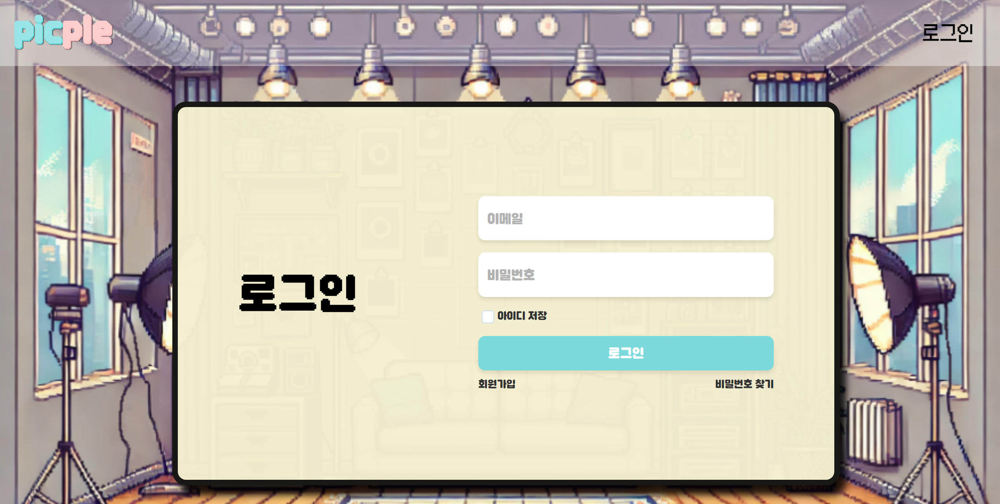
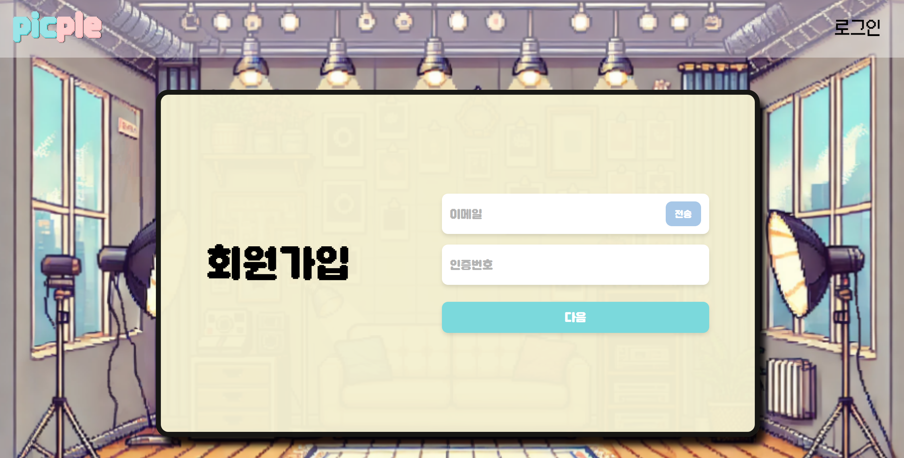
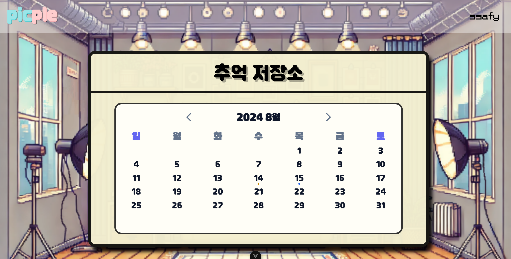
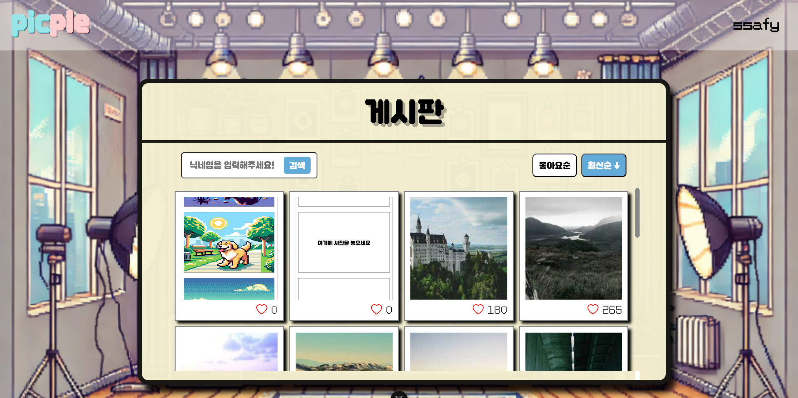
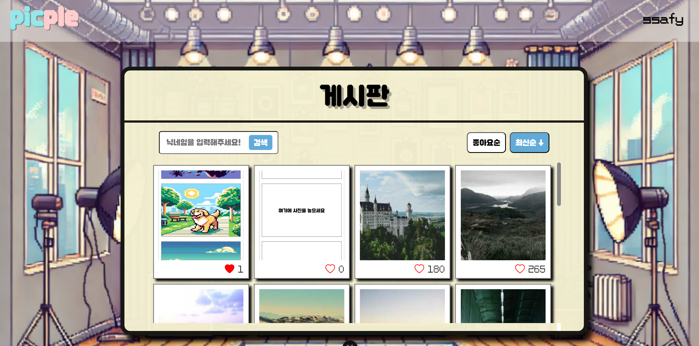

# 📷 PICPLE - 실시간 다중 사용자 사진 웹 서비스



<!-- ### Samsung Software Academy For Youth 11th - 공통 프로젝트 -->

> 2024.07.02 ~ 2024.08.16

<br>

### 서비스 소개 영상 : 

https://github.com/user-attachments/assets/8b47c4d2-41cf-4290-bbf7-75f240635348


---

## 📌 Introduction

1. [**웹 서비스 소개**](#-웹-서비스-소개)
2. [**기술 스택**](#-기술-스택)
3. [**주요 기능**](#-주요-기능)
4. [**시스템 아키텍쳐**](#-시스템-아키텍쳐)
5. [**프로젝트 파일구조**](#-프로젝트-파일-구조)
6. [**서비스 화면**](#-서비스-화면)
7. [**개발 팀 소개**](#-개발-팀-소개)
8. [**산출물**](#-산출물)

<div id="웹-서비스-소개"></div>
<br>

## ✨ 웹 서비스 소개

---

### ✨ PICPLE: 거리를 넘어 함께 찍는 특별한 순간

멀리 있는 가족, 친구들과 함께 사진을 찍고 싶었지만 방법이 없어 아쉬웠던 적이 없으신가요?

온라인으로 연결은 됐지만, 실제로 함께 있는 것 같은 느낌으로 사진을 찍을 수 있는 서비스를 찾기 어려웠던 적이 없으신가요?

Picple만의 실시간 화상 연결을 통해 전 세계 어디에 있든 함께 사진을 찍고, 특별한 순간을 공유해보세요!

#### 🌟 PICPLE만의 특별함

     ⩥ 실시간 화상 연결: 거리에 상관없이 함께 있는 듯한 생생한 경험
     ⩥ 다양한 테마와 필터: 당신만의 독특하고 창의적인 사진 제작
     ⩥ 간편한 저장과 공유: 소중한 추억을 쉽게 간직하고 주변과 나눔

#### 💡 이런 분들에게 완벽해요

     ⩥ 해외 여행 중인 친구들과 인생샷을 남기고 싶은 분
     ⩥ 멀리 떨어진 가족들과 특별한 기념일을 함께 기록하고 싶은 분
     ⩥ SNS에 올릴 독특하고 재미있는 단체 사진을 원하는 분

##### PICPLE과 함께라면, 거리는 더 이상 문제가 되지 않습니다. 지금 바로 새로운 추억을 만들어보세요!

### **[PICPLE과 함께 사진 찍기](https://i11a503.p.ssafy.io/)**

<div id="기술-스택"></div>
<br>

## 🔨 기술 스택

---

<table>
    <tr>
        <td><b>Back-end</b></td>
        <td>
            
            
            <br>
            
            
            
            <br>
            
            
            
        </td>
    </tr>
    <tr>
        <td><b>Front-end</b></td>
        <td> 
            
            
            
            
            <br>
            
            
            
            <br>
            
            
            
            
            <br>
        </td>
    </tr>
    <tr>
        <td><b>Infra</b></td>
        <td>     </td>
    <tr>
        <td><b>Tools</b></td>
        <td>
            
             
        </td>
    </tr>
</table>

<br>
<div id="주요-기능"></div>

## 💡 주요 기능

---

|             기능             | 내용                                                                                                                                                        |
| :--------------------------: | :---------------------------------------------------------------------------------------------------------------------------------------------------------- |
| **실시간 크로마키 포토부스** | 실시간 웹캠 화면에서 인물을 자동으로 크로마키 처리하여 촬영합니다. 사용자는 화면 속 인물을 자유롭게 드래그하여 크기 조절 및 위치 이동이 가능합니다.         |
|  **AI 배경 생성 및 커스텀**  | AI 기술을 활용해 다양한 배경을 생성하고 즉시 적용할 수 있습니다. 또는 사용자가 직접 로컬 이미지 파일을 업로드하여 원하는 배경으로 설정할 수 있습니다.       |
|  **추억 저장 및 공유 기능**  | 촬영한 사진은 개인 캘린더에 자동 저장되어 날짜별로 추억을 기록할 수 있습니다. 또한 커뮤니티 게시판을 통해 다른 사용자들과 특별한 순간을 공유할 수 있습니다. |

<br/>

<div id="시스템-아키텍처"></div>
<br>

## 📊 시스템 아키텍쳐

---


<br/>
<div id="프로젝트-파일-구조"></div>

## 📁 프로젝트 파일 구조

---

<details>
<summary>
<h3 style="display: inline-block; margin-right: 10px;">Backend</h3>
</summary>
<div markdown="1">

```
│  PicpleApplication.java
│
├─AwsS3
│      S3Config.java
│      S3FileUploadService.java
│
├─config
│  │  BaseTimeEntity.java
│  │  EmailConfig.java
│  │  RedisConfig.java
│  │  SecurityConfig.java
│  │  WebConfig.java
│  │  WebSocketConfig.java
│  │  WebSocketMessageConfig.java
│  │
│  └─baseResponse
│          BaseException.java
│          BaseResponse.java
│          BaseResponseStatus.java
│          GlobalExceptionHandler.java
│
├─domain
│  ├─background
│  │  ├─controller
│  │  │      BackgroundController.java
│  │  │
│  │  ├─dto
│  │  │  ├─request
│  │  │  │      CreateAIBackgroundRequest.java
│  │  │  │      CreateLocalBackgroundRequest.java
│  │  │  │      DeleteBackgroundRequest.java
│  │  │  │      ModifyBackgroundTitleRequest.java
│  │  │  │
│  │  │  └─response
│  │  │      │  BackgroundResponseDto.java
│  │  │      │  CreateBackgroundResponse.java
│  │  │      │  DefaultBackgroundResponse.java
│  │  │      │  DeleteBackgroundResponse.java
│  │  │      │  LocalFileUploadResponse.java
│  │  │      │  ModifyBackgroundTitleResponse.java
│  │  │      │
│  │  │      └─openai
│  │  │              AIBackgroundResponse.java
│  │  │              ImageObject.java
│  │  │
│  │  ├─entity
│  │  │      Background.java
│  │  │
│  │  ├─repository
│  │  │      BackgroundRepository.java
│  │  │
│  │  └─service
│  │          BackgroundService.java
│  │          BackgroundServiceImpl.java
│  │          FileUploadService.java
│  │          LocalFileService.java
│  │          OpenAIService.java
│  │
│  ├─backgrounduser
│  │  ├─controller
│  │  │      BackgroundUserController.java
│  │  │
│  │  ├─entity
│  │  │      BackgroundUser.java
│  │  │
│  │  ├─repository
│  │  │      BackgroundUserRepository.java
│  │  │
│  │  └─service
│  │          BackgroundUserService.java
│  │          BackgroundUserServiceImpl.java
│  │
│  ├─board
│  │  ├─controller
│  │  │      BoardController.java
│  │  │
│  │  ├─dto
│  │  │      BoardDto.java
│  │  │
│  │  ├─entity
│  │  │      Board.java
│  │  │
│  │  ├─repository
│  │  │      BoardRepository.java
│  │  │
│  │  └─service
│  │          BoardService.java
│  │          BoardServiceImpl.java
│  │
│  ├─boardlike
│  │  ├─controller
│  │  │      BoardLikeController.java
│  │  │
│  │  ├─entity
│  │  │      BoardLike.java
│  │  │
│  │  ├─repository
│  │  │      BoardLikeRepository.java
│  │  │
│  │  └─service
│  │          BoardLikeService.java
│  │          BoardLikeServiceImpl.java
│  │
│  ├─booth
│  │  ├─controller
│  │  │      BoothController.java
│  │  │
│  │  ├─dto
│  │  │      BoothCreateRequest.java
│  │  │
│  │  └─service
│  │          BoothService.java
│  │
│  ├─calendar
│  │  ├─controller
│  │  │      CalendarController.java
│  │  │
│  │  ├─dto
│  │  │      CalendarDto.java
│  │  │
│  │  ├─entity
│  │  │      Calendar.java
│  │  │
│  │  ├─repository
│  │  │      CalendarRepository.java
│  │  │
│  │  └─service
│  │          CalendarService.java
│  │          CalendarServiceImpl.java
│  │
│  ├─chat
│  │  ├─controller
│  │  │      ChatController.java
│  │  │
│  │  ├─entity
│  │  │      ChatMessage.java
│  │  │
│  │  ├─repository
│  │  │      ChatRepository.java
│  │  │
│  │  └─service
│  │          ChatService.java
│  │          ChatServiceImpl.java
│  │
│  ├─photo
│  │  ├─controller
│  │  │      PhotoController.java
│  │  │
│  │  ├─entity
│  │  │      Photo.java
│  │  │
│  │  ├─repository
│  │  │      PhotoRepository.java
│  │  │
│  │  └─service
│  │          PhotoService.java
│  │          PhotoServiceImpl.java
│  │
│  ├─photouser
│  │  ├─controller
│  │  │      PhotoUserController.java
│  │  │
│  │  ├─dto
│  │  │  ├─request
│  │  │  │      PhotoUserRequestDto.java
│  │  │  │
│  │  │  └─response
│  │  │          PhotoUserResponseDto.java
│  │  │
│  │  ├─entity
│  │  │      PhotoUser.java
│  │  │
│  │  ├─repository
│  │  │      PhotoUserRepository.java
│  │  │
│  │  └─service
│  │          PhotoUserService.java
│  │          PhotoUserServiceImpl.java
│  │
│  └─user
│      ├─controller
│      │      UserController.java
│      │
│      ├─dto
│      │  ├─request
│      │  │      EmailCheckRequest.java
│      │  │      EmailRequest.java
│      │  │      LoginRequest.java
│      │  │      ModifyNicknameRequest.java
│      │  │      ModifyPasswordRequest.java
│      │  │      ResetPasswordRequest.java
│      │  │
│      │  └─response
│      │          LoginResponse.java
│      │          ModifyConfirmResponse.java
│      │          UserInfoResponse.java
│      │
│      ├─entity
│      │      User.java
│      │
│      ├─repository
│      │      UserRepository.java
│      │
│      └─service
│              EmailService.java
│              EmailServiceImpl.java
│              UserService.java
│              UserServiceImpl.java
│
├─interceptor
│      JWTInterceptor.java
│
├─util
│      JWTUtil.java
│      RedisUtil.java
│      S3Service.java
│
└─websocket
        BoothWebSocketHandler.java
        SignalMessage.java
        WebSocketHandler.java
```

</div>
</details>

<details>
<summary>
<h3 style="display: inline-block; margin-right: 10px;">Frontend</h3>
</summary>
<div markdown="1">

```
│  .gitignore
│  Dockerfile
│  index.html
│  jsconfig.json
│  package-lock.json
│  package.json
│  README.md
│  vite.config.js
│
├─public
│      favicon.ico
│      picple.png
│
└─src
    │  App.vue
    │  main.js
    │
    ├─api
    │      baseApi.js
    │      boardApi.js
    │      userApi.js
    │
    ├─assets
    │  ├─audio
    │  │      shutter.mp3
    │  │
    │  ├─css
    │  │      boothsSelectTemp.css
    │  │      calendar.css
    │  │      calendarModal.css
    │  │      form.css
    │  │      header.css
    │  │      main.css
    │  │      mainView.css
    │  │
    │  ├─icon
    │  │      camera.png
    │  │      heart-fill.svg
    │  │      heart.png
    │  │      heart.svg
    │  │      micro_off.png
    │  │      micro_on.png
    │  │      three-dots-vertical.svg
    │  │      video_off.png
    │  │      video_on.png
    │  │
    │  └─img
    │      │  tempImg.png
    │      │
    │      ├─app
    │      │      backgroundImg.png
    │      │      pointer.png
    │      │
    │      ├─calendar
    │      │      arrow-left.png
    │      │      arrow-right.png
    │      │      landscape_84.png
    │      │      landscape_lion.png
    │      │      portrait_48.png
    │      │      portrait_jj4.jpeg
    │      │      portrait_messi3.png
    │      │      share.png
    │      │
    │      ├─common
    │      │      close.png
    │      │      return.png
    │      │
    │      ├─mainView
    │      │      board.jpg
    │      │      calender.jpg
    │      │      camera.jpg
    │      │      noimage.png
    │      │      picpleLogo.png
    │      │
    │      └─template
    │              temp_1x1_4x3_479x360.jpg
    │              temp_1x2_4x5_288x360.jpg
    │              temp_1x3_3x4_270x360.png
    │              temp_2x2_4x3_481x360.jpg
    │              어벤져스1.jpg
    │              어벤져스2.jpg
    │              어벤져스3.jpg
    │              어벤져스4.jpg
    │              어벤져스5.jpg
    │              어벤져스6.jpg
    │
    ├─components
    │  ├─board
    │  │      BoardModalComp.vue
    │  │      BoardPhotoComp.vue
    │  │
    │  ├─booth
    │  │      BoothBackComp.vue
    │  │      BoothSelectBackComp.vue
    │  │      BoothShowPhotoComp.vue
    │  │
    │  ├─calendar
    │  │      ListModalComp.vue
    │  │
    │  ├─common
    │  │      MainHeaderComp.vue
    │  │      PageComp.vue
    │  │      WhiteBoardComp.vue
    │  │
    │  └─form
    │          FormButtonComp.vue
    │          FormComp.vue
    │          FormEmailComp.vue
    │          FormIconCancelComp.vue
    │          FormIconVisibilityComp.vue
    │          FormInputComp.vue
    │          FormMessageComp.vue
    │
    ├─composables
    │      calendarModal.js
    │      validation.js
    │
    ├─router
    │      index.js
    │
    ├─stores
    │      formStore.js
    │      photoStore.js
    │      userStore.js
    │
    └─views
        │  BoardView.vue
        │  CalendarView.vue
        │  MainView.vue
        │
        ├─account
        │      FindPasswordView.vue
        │      LoginView.vue
        │      ModifyAccountView.vue
        │      ModifyPasswordView.vue
        │      SignupEmailView.vue
        │      SignupView.vue
        │
        └─booth
                BoothCodeView.vue
                BoothCreateView.vue
                BoothInsertView.vue
                BoothShootView.vue
                BoothTemplateView.vue
```

</div>
</details>

<br>
<div id="서비스-화면"></div>

## 💻 서비스 화면

---

### 메인 화면



### 로그인



### 회원가입



### 이메일 인증


### 부스 생성


### 사진 촬영(AI 배경)


### 프레임 적용


### 사진 저장


### 부스 참여자


### 캘린더




### 게시판





<br>
<div id="개발-팀-소개"></div>

## 👨🏻‍💻 개발 팀 소개

---

|  |  |  |  |  |  |
| :----------------------------------------------------------------------------------------: | :-----------------------------------------------------------------------------------------: | :----------------------------------------------------------------------------------------: | :-----------------------------------------------------------------------------------------: | :-----------------------------------------------------------------------------------------: | :----------------------------------------------------------------------------------------: |
|            [김예훈<br>@gnsdp99](https://github.com/gnsdp99)<br/>`MAIN FRONTEND`            |          [김현재<br>@Kguswo](https://github.com/Kguswo)<br/>`LEADER`<br>`BACKEND`           |       [박성훈<br>@seongddiyong](https://github.com/seongddiyong)<br/>`MAIN BACKEND`        |            [염규영<br>@gyuoo](https://github.com/gyuoo)<br/>`BACKEND` <br> `AI`             |          [옥진석<br>@JJOK97](https://github.com/JJOK97)<br/>`FRONTEND`<br>`WEBRTC`          |           [유병주<br>@youbj](https://github.com/youbj)<br/>`FRONTEND`<br>`Infra`           |

<br />
<div id="산출물"></div>

## 📝 산출물

---

### 1. [기능 명세서](https://thrilling-hickory-561.notion.site/2f908e6d3f4945fead2998969a572a51?pvs=4)

### 2. [와이어 프레임](https://www.figma.com/design/vZCRcTeV7l1uY29kUnykgc/PICPLE?node-id=0-1&t=XmfEvX8iE1Da69Hr-1)

### 3. [API 명세서](https://thrilling-hickory-561.notion.site/API-be69eb37997347619a71459698c03023?pvs=4)

### 4. [ERD](https://thrilling-hickory-561.notion.site/ERD-Diagram-a69e27fc5f9f45418beae19d41002f5c?pvs=4)

### 5. [포팅매뉴얼](https://thrilling-hickory-561.notion.site/d57f6244c5c74cf1880763b3725b8183?pvs=4)
